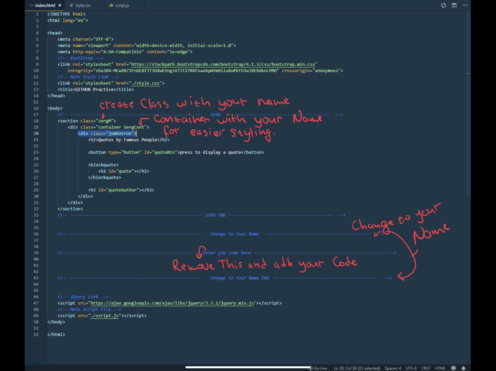
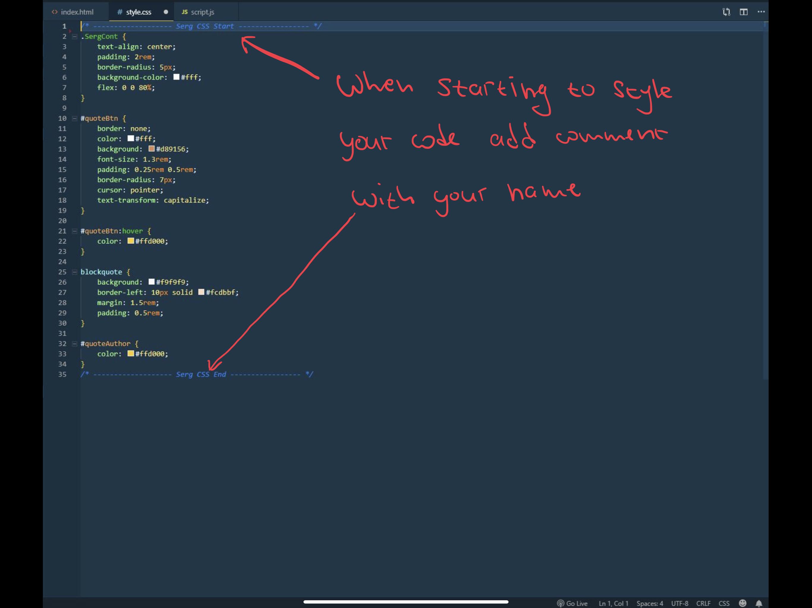
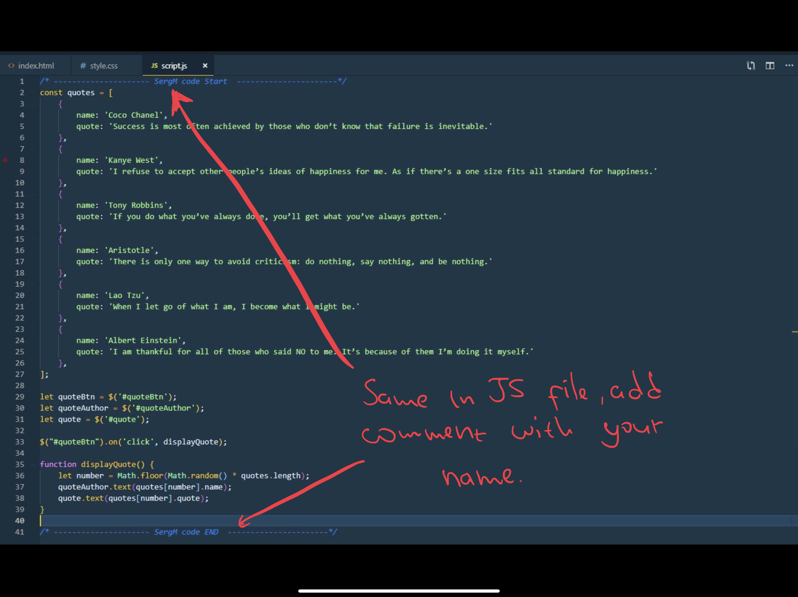

# Hey Champs!!

### We getting close to Project 2 and it that time again when we all need to work with GitHub with our Teams.

I figure out the best way to practice is to create a project in which the entire class can practice their GitHub skills.

Project is not locked, so anybody can merge it anytime. So PLEASE FOLLOW simple RULES.

Simple RULES:
  1. - Clone this repo and create your own branch
  2. - In index.html change comments "Change to Your Name" to your name
   * Create section with class="" and name class with Your first name and first letter of your last name
   * Then create `
 
` ... your code ... `
 
`
   * Make sure too add your own id or class to "container" class, this way is easy to add style and not 
    confilict with anybody else css. 
    See 
    
  3. - In Jumbotron, you can create whatever you want, can just simple h1 tag or small app like I did, it's up to your imagination. 
   (there is style.css and script.js file if you want to add style or functionality to your section. Also, I included Bootstrap and jQuery, so you can use any tools you like if you wish. 
   
   4. - If you use style.css or script.js make to comment out when you code to start and end.
   
   5. - Once you add your code and you ready to commit to master go head and do so.
   
   6. **MOST IMPORTANT RULE - HAVE FUN**. You can change your own code as many times as you like. **DO NOT CHANGE SOMEONE ELSE CODE.**
   
   Thanks all. 
   
   
   
   
  
   
  
   
